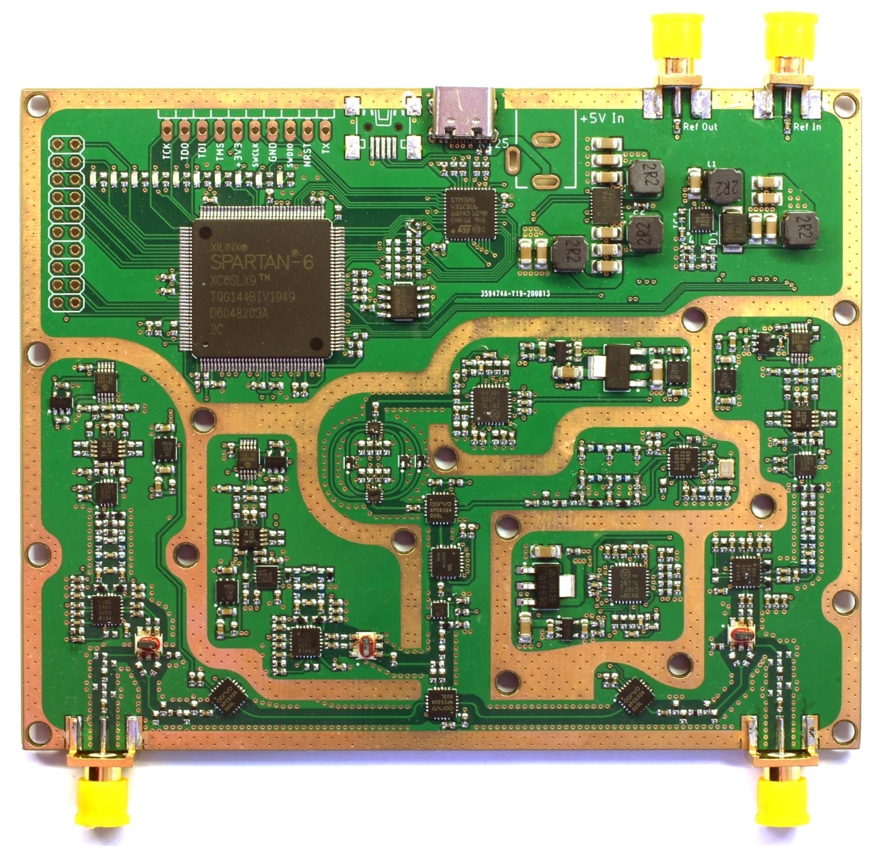
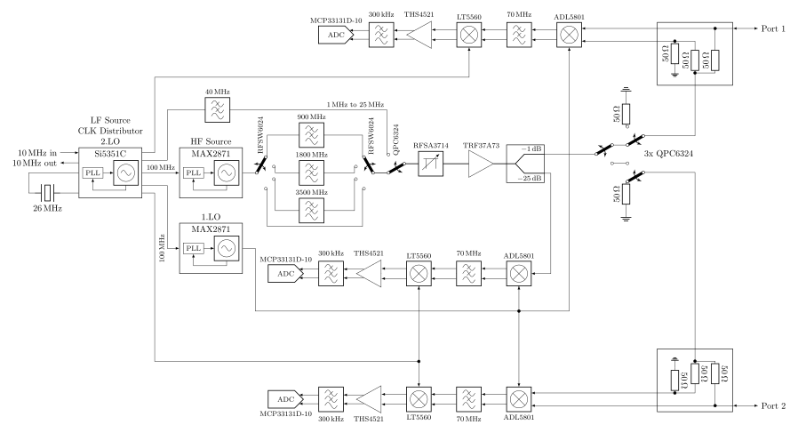
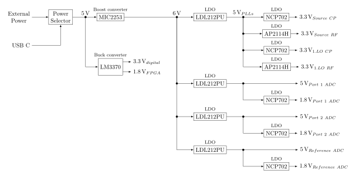

# 1MHz - 6GHz VNA2
**!work in progress, more information will be added in the future!**

This is the improved version of my [first attempt](https://www.github.com/jankae/VNA) at a VNA.

Main differences to first version:
* Exchanged some RF chips for slightly cheaper versions with similar specifications
* Power supply scheme changed to use 5V instead of 12V, potentially allowing the device to be powered from USB
* FPGA gets configured from the microcontroller, removing the need for a JTAG programmer. This also allows firmware updates of both the FPGA and the microcontroller through the USB port
* RF sections distributed differently on PCB to increase isolation between ports

### Preliminary specifications
* Frequency range: 1MHz to 6GHz (with reduced performance also below 1MHz)
* Dynamic range (S12/S21):
  * below 3GHz: 80-90db
  * above 3GHz: 50-60db
* Sweep rate: up to 10k points/second (each point includes measurement of all four S-parameters)

There are also some initial [example measurements](Documentation/Measurements/Measurements.md).

## How does it work?
The PCB is really only the RF frontend with some processing power. Everything else is handled in the PC application once the data is transferred via USB. You can try out the application without the PCB (obviously no measurements are possible, but you can import provided example measurements and get an idea about what it can and can't do). Either [build it yourself](Documentation/DeveloperInfo/BuildAndFlash.md) or use a pre-built binary (only Windows/Ubuntu at the moment). Feel free to create issues (or even better pull-requests) if you find any bugs. An (incomplete) [manual](Documentation/UserManual/manual.pdf) is available.
### RF path:

* The main clock source is an Si5351C, providing all the required clocks for the different blocks. It also serves as the stimulus source for frequencies below 25MHz. Its own reference clock is either a 26MHz crystal or an external 10MHz signal.
* The stimulus source for frequencies above 25MHz is a MAX2871. Its output signal is slightly filtered to reduce the amount of harmonics.
* The stimulus signal power can be adjusted between approximately -42 and -10dbm with a digital attenuator (RFSA3714).
* After the amplifier(TRF37A73) the signal is split and the weaker part of it fed into the reference receiver.
* The stronger part of the signal can be routed to either port. In each signal path, two RF switches are used in series to achieve higher isolation between the ports.
* Instead of directional couplers, resistive return-loss-bridges are used (easier to implement for wide bandwidth).
* Both ports have completely separated receive paths. This increases BOM cost but allows measuring two parameters at once (S11 and S21 or S22 and S12). It also avoids potential isolation issues that could arise if the receive paths would merge into a single mixer/ADC.
* Each receiver consists of two down-convert mixers. The 1.IF sits at 60MHz, the 2.IF 250kHz.
* The ADCs are sampling the final IF with 16bit@800kHz.

### Digital section:

* The central element is the Spartan6 FPGA. It handles all communication with the RF blocks and samples the ADCs. This allows for nearly instant switching of the measurement frequency, only limited by the settling time of the PLLs.
* The microcontroller handles the setup of the sweep in the FPGA, extracts and preprocesses the measurements and passes them on through USB.
* The flash contains the FPGA bitstream. Because the microcontroller has access to the flash, no FPGA-related hardware tools (such as JTAG programmers) are needed, everything can be updated via USB.

### Power supply:

* Everything is powered from USB (or optionally by external 5V DC)
* Almost every RF block has its own local regulater, preventing noise and signals coupling into the supply lines from propagating across the whole PCB

## Want to know more?
Check out the [FAQ](Documentation/FAQ.md) or write me a mail.
